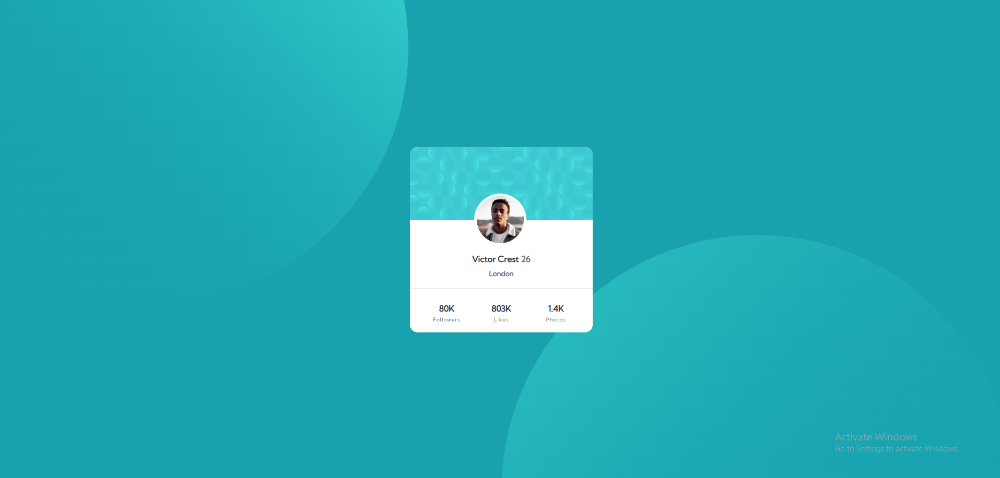

# Frontend Mentor - Profile card component solution

This is a solution to the [Profile card component challenge on Frontend Mentor](https://www.frontendmentor.io/challenges/profile-card-component-cfArpWshJ). Frontend Mentor challenges help you improve your coding skills by building realistic projects. 

## Table of contents

- [Overview](#overview)
  - [The challenge](#the-challenge)
  - [Screenshot](#screenshot)
  - [Links](#links)
- [My process](#my-process)
  - [Built with](#built-with)
  - [What I learned](#what-i-learned)
  - [Continued development](#continued-development)
  - [Useful resources](#useful-resources)
- [Author](#author)
- [Acknowledgments](#acknowledgments)

## Overview

Profile card component

### The challenge

- Build out the project to the designs provided

### Screenshot



### Links

- Solution URL: [Add solution URL here](https://your-solution-url.com)
- Live Site URL: [Add live site URL here](https://your-live-site-url.com)

## My process

### Built with

- Semantic HTML5 markup
- CSS custom properties
- Flexbox
- CSS Grid

### What I learned

- Positioned background images.

```html
<div class="bg-pattern-top">
    
  </div>

  <div class="bg-pattern-bottom">
    
  </div>
```
```css
html,body{
    overflow: hidden;
    position: relative;
}
.bg-pattern-top {
    max-width: 100%;
    position: absolute;
    top: 10%;
    left: 0%;
    transform: translate(-20%, -50%);
    overflow: hidden;
}
 .bg-pattern-bottom {
    width: 100%;
    max-width: 1000px;
    height: auto;
    position: absolute;
    top: 49%;
    left: 50%;
    overflow: hidden;
}
```
### Continued development

- In future projects will focus on using css frameworks.

### Useful resources

- [CSS Tricks](https://css-tricks.com/centering-css-complete-guide/) - This helped me for Centering in CSS. I really liked this pattern and will use it going forward.
- [MDN Web Docs](https://developer.mozilla.org/en-US/docs/Glossary/Flexbox) - This is an amazing free resource which helped me finally understand Flexbox. I'd recommend it to anyone still learning this concept.

## Author

- GitHub - [@Jayajo5](https://github.com/Jayajo5)
- Frontend Mentor - [@Jayajo5](https://www.frontendmentor.io/profile/Jayajo5)

## Acknowledgments

A big thanks to the Frontend Mentor community for feedback and inspiration! 🚀